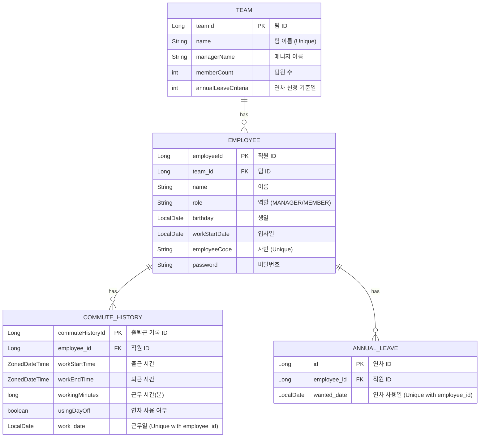

# office-commute

## API 문서 확인하기

테스트 기반으로 생성된 API 문서를 확인할 수 있습니다.

```bash
# 문서 생성 (테스트 실행 후 HTML 생성)
./gradlew asciidoctor

# 브라우저에서 열기 (macOS)
open build/docs/asciidoc/index.html

# 또는 직접 파일 경로로 접근
# build/docs/asciidoc/index.html
```

> Spring REST Docs를 사용하여 테스트 코드 기반으로 API 문서를 생성합니다.
> 테스트가 통과해야만 문서가 생성되므로, 문서와 실제 API의 일치가 보장됩니다.

---

## 개요
Spring Boot와 JPA 학습 후, 시간, 날짜, 돈과 관련된 데이터를 다루는 실무적인 문제 해결 경험을 목표로 `사내 출퇴근 관리 시스템`을 개발했습니다. 

## 기술 스택
- Language: Java 21
- Framework: Spring Boot 3.5.5
- Modules: Spring Data JPA, Spring Security, Spring Web, Spring Validation
- Database: MySQL 8.0, H2
- Build Tool: Gradle
- Library: Apache POI

## 주요 기능
- 직원 및 팀 관리
  - 팀 등록 및 조회: 회사의 팀을 등록하고, 각 팀의 이름, 관리자, 소속 인원을 전체 조회할 수 있습니다.
  - 직원 등록 및 조회: 직원의 기본 정보(이름, 역할, 입사일, 생일)와 소속 팀을 등록하고 전체 목록을 조회할 수 있습니다.
- 출퇴근 및 근무 시간 관리
  - 출퇴근 시간 기록: 직원의 ID를 기준으로 출근 및 퇴근 시간을 서버에 기록합니다.
  - 월별 근무 시간 조회: 특정 직원의 월별 근무 기록을 날짜별로 조회하고, 해당 월의 총 근무 시간을 '분' 단위로 합산하여 제공합니다.
- 연차 관리
  - 연차 신청: 직원은 하루 단위로 연차를 신청할 수 있으며, 신청된 연차는 즉시 시스템에 반영됩니다.
  - 팀별 연차 정책 적용: 팀마다 '연차 사용 N일 전 등록'과 같은 자체 규정을 설정하고, 신청 시점에 해당 규정을 충족하는지 검증하는 유연한 정책을 적용할 수 있습니다.
  - 남은 연차 조회: 직원은 자신의 남은 연차 수를 확인할 수 있습니다.
- 초과 근무 정산 및 리포트
  - 초과 근무 시간 자동 계산: 공휴일과 주말을 제외한 월별 법정 근무 시간을 기준으로, 모든 직원의 초과 근무 시간을 분 단위로 자동 계산합니다.
  - 공휴일 정보 외부 API 연동: 공공데이터포털의 특일 정보 API를 연동하여 매년 변동되는 공휴일을 정확하게 계산에 반영합니다.
  - Excel 리포트 다운로드: 월별 초과 근무 현황(직원명, 부서명, 초과 근무 시간, 수당)이 담긴 Excel(.xlsx) 파일을 생성하고 다운로드하는 기능을 제공합니다.

## ERD


## Architecture

```mermaid
graph TD
    subgraph "Client"
        User["👤<br/>User"]
    end

    subgraph "Application Server"
        Interceptor["🔐<br/>Auth Interceptor"]
        Controllers["Presentation Layer<br/>(Controllers)"]
        Services["Business Logic Layer<br/>(Services)"]
        Repositories["Data Access Layer<br/>(Repositories)"]
    end

    subgraph "External Services"
        ExternalAPI["📅<br/>External API<br/>(Public Data)"]
    end

    subgraph "Database"
        DB["🗄️<br/>Database<br/>(MySQL / H2)"]
    end

    %% High-Level Flow
    User -- "1. HTTP Request" --> Interceptor
    Interceptor -- "2. Authentication" --> Controllers
    Controllers -- "3. Business Logic Call" --> Services
    Services -- "4. Data Request" --> Repositories
    Repositories -- "5. DB Query" --> DB
    
    %% External Service Flow
    Services -- "External API Call" --> ExternalAPI


    %% Styling (Dark Mode Friendly)
    classDef default fill:#2d333b,stroke:#8b949e,stroke-width:2px,color:#adbac7,border-radius:5px;
    classDef client fill:#0e3820,stroke:#3fb950;
    classDef external fill:#422224,stroke:#ff8585;
    classDef db fill:#17304f,stroke:#6cb6ff;
    classDef interceptor fill:#48321a,stroke:#eac54f;
    
    class User client;
    class ExternalAPI external;
    class DB db;
    class Interceptor interceptor;
```

