# office-commute

## 개요
Spring Boot와 JPA 학습 후, 시간, 날짜, 돈과 관련된 데이터를 다루는 실무적인 문제 해결 경험을 목표로 `사내 출퇴근 관리 시스템`을 개발했습니다. 

## 기술 스택
- Language: Java 21
- Framework: Spring Boot 3.5.5
- Modules: Spring Data JPA, Spring Security, Spring Web, Spring Validation
- Database: MySQL 8.0, H2
- Build Tool: Gradle
- Library: Apache POI

## 주요 기능
- 직원 및 팀 관리
  - 팀 등록 및 조회: 회사의 팀을 등록하고, 각 팀의 이름, 관리자, 소속 인원을 전체 조회할 수 있습니다.
  - 직원 등록 및 조회: 직원의 기본 정보(이름, 역할, 입사일, 생일)와 소속 팀을 등록하고 전체 목록을 조회할 수 있습니다.
- 출퇴근 및 근무 시간 관리
  - 출퇴근 시간 기록: 직원의 ID를 기준으로 출근 및 퇴근 시간을 서버에 기록합니다.
  - 월별 근무 시간 조회: 특정 직원의 월별 근무 기록을 날짜별로 조회하고, 해당 월의 총 근무 시간을 '분' 단위로 합산하여 제공합니다.
- 연차 관리
  - 연차 신청: 직원은 하루 단위로 연차를 신청할 수 있으며, 신청된 연차는 즉시 시스템에 반영됩니다.
  - 팀별 연차 정책 적용: 팀마다 '연차 사용 N일 전 등록'과 같은 자체 규정을 설정하고, 신청 시점에 해당 규정을 충족하는지 검증하는 유연한 정책을 적용할 수 있습니다.
  - 남은 연차 조회: 직원은 자신의 남은 연차 수를 확인할 수 있습니다.
- 초과 근무 정산 및 리포트
  - 초과 근무 시간 자동 계산: 공휴일과 주말을 제외한 월별 법정 근무 시간을 기준으로, 모든 직원의 초과 근무 시간을 분 단위로 자동 계산합니다.
  - 공휴일 정보 외부 API 연동: 공공데이터포털의 특일 정보 API를 연동하여 매년 변동되는 공휴일을 정확하게 계산에 반영합니다.
  - Excel 리포트 다운로드: 월별 초과 근무 현황(직원명, 부서명, 초과 근무 시간, 수당)이 담긴 Excel(.xlsx) 파일을 생성하고 다운로드하는 기능을 제공합니다.

## ERD

```mermaid
erDiagram
    EMPLOYEE {
        Long employeeId PK "직원 ID"
        Long team_id FK "팀 ID"
        String name "이름"
        String role "역할 (MANAGER/MEMBER)"
        LocalDate birthday "생일"
        LocalDate workStartDate "입사일"
        String employeeCode "사번 (Unique)"
        String password "비밀번호"
    }

    TEAM {
        Long teamId PK "팀 ID"
        String name "팀 이름 (Unique)"
        String managerName "매니저 이름"
        int memberCount "팀원 수"
        int annualLeaveCriteria "연차 신청 기준일"
    }

    COMMUTE_HISTORY {
        Long commuteHistoryId PK "출퇴근 기록 ID"
        Long employee_id FK "직원 ID"
        ZonedDateTime workStartTime "출근 시간"
        ZonedDateTime workEndTime "퇴근 시간"
        long workingMinutes "근무 시간(분)"
        boolean usingDayOff "연차 사용 여부"
        LocalDate work_date "근무일 (Unique with employee_id)"
    }

    ANNUAL_LEAVE {
        Long id PK "연차 ID"
        Long employee_id FK "직원 ID"
        LocalDate wanted_date "연차 사용일 (Unique with employee_id)"
    }

    EMPLOYEE ||--o{ COMMUTE_HISTORY : "has"
    EMPLOYEE ||--o{ ANNUAL_LEAVE : "has"
    TEAM ||--o{ EMPLOYEE : "has"
```

## Architecture

