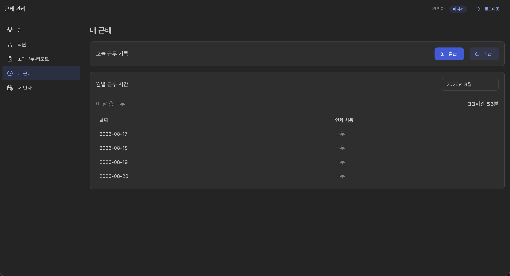
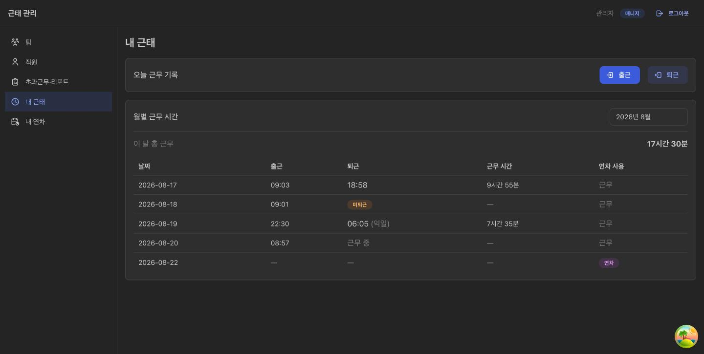

# Solution 1. 내 근태 — 출퇴근 시각 노출과 "오늘" 판정의 서버 이관

- 날짜: 2026-08-20
- 경위: 운영 서버(EC2)에 올라간 **내 근태** 화면의 "월별 근무 시간" 표가 날짜와 연차 사용 여부만
  보여주고 있었다. 언제 출근했고 언제 퇴근했는지가 화면에 없다는 지적에서 출발해,
  API 계약·응답 조립·화면을 함께 손봤다.
- 관련 경로:
  `MyCommutePage` → `useWorkDuration` → `GET /api/commute` → `CommuteHistoryController`
  → `CommuteHistoryService.getWorkDurationPerDate` → `CommuteHistories` → `CommuteDetailResponse`

## 요약표

| # | 문제 | 해결 |
|---|---|---|
| 1 | 출퇴근 시각이 응답에도 화면에도 없음 | `CommuteDetail`에 `workStartTime`·`workEndTime` 추가 (workZone 오프셋 부착) |
| 2 | `workingMinutes`가 이미 wire에 실려 있었으나 `openapi.yml`에 없는 스펙 드리프트 | 스펙에 명시하고 화면 컬럼으로 노출 |
| 3 | 응답이 도메인 객체 `DailyWorkDuration`을 그대로 노출 (기존 TODO) | `CommuteDetailResponse` 신설, 도메인은 합계 계산 입력으로만 잔존 |
| 4 | "근무 중"과 "미퇴근"을 프론트가 **브라우저 날짜**로 유추 | `CommuteStatus`를 서버가 기록의 `workZone`으로 판정해 응답에 포함 |

---

## 1. 출퇴근 시각을 어떤 모양으로 내려보낼 것인가

`CommuteHistory`는 출퇴근 시각을 이미 `Instant`로 들고 있었고 `work_zone` 컬럼도 있었다.
DB 마이그레이션은 필요 없었고, 정할 것은 **wire 포맷** 하나였다.

검토한 세 가지:

| 안 | 문제 |
|---|---|
| `Instant` 그대로 (`...Z`) | 프론트가 `new Date()`로 파싱하면 **브라우저 타임존**으로 재해석된다. 엔티티가 명시한 "달력 해석은 workZone과 조합해서만 한다"는 계약과 정면으로 어긋난다 |
| 백엔드가 `"09:03"` 문자열로 가공 | 표시에는 충분하지만 자정을 넘긴 근무를 표현할 수 없고, 야간근로(22~06시) 같은 후속 계산에 재사용할 수 없다 |
| **workZone 오프셋을 붙인 `OffsetDateTime`** | 채택 |

채택안은 순간(instant)을 잃지 않으면서 달력 해석까지 응답에 담는다:

```json
{ "date": "2026-08-19", "workStartTime": "2026-08-19T22:30:00+09:00",
                        "workEndTime":   "2026-08-20T06:05:00+09:00" }
```

프론트는 문자열에서 `HH:mm`을 잘라 쓴다(`formatZonedTime`). `Date`를 거치지 않으므로
브라우저 타임존이 개입할 여지 자체가 없다. 자정을 넘긴 근무는 `workEndTime`의 날짜 부분이
`date`와 달라지므로 화면에서 `06:05 (익일)`로 구분해 보여준다 — 시각만 보이면
8시간 근무가 -16시간으로 읽힌다.

**연차·미퇴근은 `null`.** 연차 기록은 `registerAnnualLeave`가 출퇴근 시각을 자정으로
합성한 값이라 표시할 시각이 없다. `spring.jackson.default-property-inclusion: non_null`
때문에 두 경우 모두 필드 자체가 응답에서 빠지고, 스펙에서도 `required` 밖에 두었다.

### 딸려 나온 정리 두 가지

- **스펙 드리프트.** `DailyWorkDuration`에 `getWorkingMinutes()`가 있어 Jackson이
  `workingMinutes`를 이미 직렬화하고 있었는데 `openapi.yml`에는 없었다. 생성 타입에
  안 잡히니 화면에서도 못 쓰고 있었다. 스펙에 올리고 "근무 시간" 컬럼으로 노출했다.
- **도메인 누출.** `WorkDurationPerDateResponse`가 도메인 객체 `DailyWorkDuration`을
  그대로 응답 원소로 쓰고 있었다(`CommuteHistories`에 `// TODO 여기서 dto 변환 처리를
  해줘도 되는지` 주석이 남아 있던 자리). `CommuteDetailResponse`를 만들어 경계를 세웠고,
  `DailyWorkDuration`은 `DailyWorkDurations.sumWorkingMinutes()`의 입력으로만 남는다.

## 2. "근무 중"인가 "미퇴근"인가 — 판정 주체를 서버로 옮겼다

`workEndTime`이 없는 행은 두 가지를 동시에 뜻한다. **아직 퇴근을 안 찍은 오늘**일 수도,
**퇴근을 잊고 날이 지나간 기록**일 수도 있다. 후자는 TODO.md 4번이 다루는 미마감 기록으로,
`workingMinutes=0`으로 집계에 들어가 그 직원의 초과근무를 과소 집계한다(= 임금 미지급).
본인 화면에서 눈에 띄어야 스스로 교정을 요청할 수 있으므로 경고 배지로 구분하기로 했다.

**1차 구현은 프론트가 유추했다.** 행의 `date`를 브라우저 로컬 날짜와 비교했다:

```tsx
if (detail.date === today()) return <Text c="dimmed" span>근무 중</Text>;
return <Badge color="orange" variant="light">미퇴근</Badge>;
```

여기서 비교되는 두 값은 **서로 다른 시계**에서 나온다. `date`는 직원의 `workZone` 기준
근무일이고, `today()`는 노트북 OS 타임존 기준 오늘이다. 둘이 다르면 하루 경계 근처에서
어긋나고, 어긋나면 근무 중인 오늘 기록이 "미퇴근" 경고로 뜨거나 그 반대가 된다.

이 프로젝트는 애초에 직원별 타임존을 모델링해 뒀으므로(`employee.timezone`,
`commute_history.work_zone`), 판정도 그 모델을 따르는 것이 일관적이다. 서버는 유추할
필요가 없다 — 직원의 타임존과 주입된 `Clock`을 둘 다 갖고 있다.

**저장하지 않는다.** 상태는 시간에 의존하는 값이다. 같은 행이 오늘 오후엔 `IN_PROGRESS`지만
내일 아침엔 `UNCLOSED`가 되어야 한다. 컬럼으로 두면 누군가 매일 갱신해야 하고, 그 배치가
한 번 밀리면 화면이 조용히 거짓말을 한다. DB에는 이미 `work_end_time IS NULL`과 `work_zone`이
있으니 조회 시점에 `Clock`만 얹으면 되고, **마이그레이션도 새 컬럼도 없다.**

```java
// CommuteHistory
public CommuteStatus status(Instant now) {
    if (isAnnualLeaveDate())     return CommuteStatus.DAY_OFF;
    if (this.workEndTime != null) return CommuteStatus.COMPLETED;
    LocalDate todayInWorkZone = now.atZone(ZoneId.of(this.workZone)).toLocalDate();
    if (this.workDate.isBefore(todayInWorkZone)) return CommuteStatus.UNCLOSED;
    return CommuteStatus.IN_PROGRESS;
}
```

**"오늘"을 직원의 현재 타임존이 아니라 기록 자신의 `workZone`으로 판정한 것**이 의도적인
선택이다. `workDate`가 애초에 그 zone에서 파생된 값이므로, 같은 zone으로 비교해야 양변이
같은 달력 위에 놓인다. 직원이 타임존을 옮겨도 과거 기록의 판정이 흔들리지 않는다.

프론트는 이제 `switch (detail.status)`로 배지에 매핑만 한다. 브라우저 날짜를 만들던
`today()` 헬퍼는 지웠다 — 남겨두면 다음 사람이 다시 쓴다.

## 3. 화면

### 이전



운영 서버(EC2) 화면. 표에 **날짜와 연차 사용** 두 컬럼뿐이라, 하단 합계로 "이 달 33시간 55분"은
알 수 있어도 각 날에 언제 출근해서 언제 퇴근했는지는 알 수 없다. 퇴근을 안 찍은 날조차
다른 날과 구분되지 않는다.

### 이후



한 화면에 다섯 가지 행 상태가 모두 나오도록 dev 프로파일에 합성 데이터를 넣고 확인했다
(스크래치패드 SQL로 주입했고 저장소 파일은 건드리지 않았다). 위 운영 화면과는 데이터가
다르므로 행을 일대일로 비교할 대상은 아니고, 봐야 할 것은 컬럼 구성과 상태 표기다.

| 날짜 | 상태 | 화면 |
|---|---|---|
| 08-17 | `COMPLETED` | `09:03` / `18:58` / 9시간 55분 |
| 08-18 | `UNCLOSED` | 퇴근 칸에 **미퇴근** 주황 배지 |
| 08-19 | `COMPLETED` (자정 넘김) | `22:30` / `06:05 (익일)` / 7시간 35분 |
| 08-20 | `IN_PROGRESS` | 퇴근 칸에 `근무 중` |
| 08-22 | `DAY_OFF` | 시각 전부 `—`, 연차 배지 |

이미지 형식이 섞여 있는 것(`before.png` / `after.jpg`)은 캡처 경로가 달라서다 —
변경 전은 직접 캡처, 변경 후는 브라우저 자동화 도구가 jpeg로 출력한 것을 그대로 썼다.

## 4. 고정한 테스트

핵심은 `CommuteHistoryTest.status_judgesTodayByWorkZoneNotByTheServerOrCallerZone`이다.
일부러 서울이 아니라 **LA** 기록을 쓴다 — 서울 기록으로는 이 버그가 재현되지 않는다.
LA 기준 1월 2일 18:00에 아직 근무 중인 기록을 UTC로 읽으면 이미 1월 3일이라
"날이 지난 미마감"으로 뒤집히는데, `workZone`으로 판정하므로 `IN_PROGRESS`가 유지된다.
판정 zone을 되돌리는 회귀가 생기면 이 테스트가 깨진다.

| 위치 | 테스트 | 고정하는 것 |
|---|---|---|
| `CommuteHistoryTest` | `zonedTimes_areRenderedInWorkZoneOffset` | workZone 오프셋 부착, 자정 넘김이 응답에 남음 |
| `CommuteHistoryTest` | `zonedTimes_useWorkZoneNotTheZoneTheInstantWasCreatedIn` | 표시 zone은 기록의 workZone이지 Instant가 만들어진 zone이 아님 |
| `CommuteHistoryTest` | `zonedWorkEndTime_isNullWhileCommuteIsOpen` / `zonedTimes_areNullForAnnualLeave` | 표시할 시각이 없는 두 경우 |
| `CommuteHistoryTest` | `status_*` 4종 | `COMPLETED`/`IN_PROGRESS`/`UNCLOSED`/`DAY_OFF` 각 진입 조건 |
| `CommuteHistoryTest` | `status_judgesTodayByWorkZoneNotByTheServerOrCallerZone` | **판정 zone** (위 설명) |
| `CommuteHistoryServiceIntegrationTest` | `monthlyViewCarriesCheckInAndCheckOutTimes` | 월별 조회가 시각·근무시간·상태·합계를 함께 돌려줌 |
| `CommuteHistoryControllerTest` | `getWorkDurationPerDate_returns200` | wire JSON 계약 — null 시각은 필드가 빠진다 |

프론트에는 테스트 프레임워크가 없다. 게이트는 `pnpm build`(`tsc --noEmit` 포함)와 `pnpm lint`,
그리고 아래의 실기동 확인이다.

## 5. 검증

1. `./gradlew openApiValidate` — 스펙 문법
2. `cd frontend && pnpm gen:api` — `schema.d.ts` 재생성 (**손으로 고치지 않는다**)
3. `./gradlew test` 전체 통과
4. `pnpm build` + `pnpm lint` 통과
5. dev 프로파일 실기동 후 `GET /api/commute?yearMonth=2026-08`로 다섯 행이 각각 의도한
   시각·상태로 내려오는지 확인, 이어서 브라우저로 화면 렌더 확인

이 저장소는 spec-first다. `openapi.yml` → `pnpm gen:api` → Java DTO 수동 동기화 순서를
지켜야 한다. `openApiValidate`는 yml 문법만 보므로 **DTO와 스펙의 어긋남은 잡아주지 않는다** —
3·5번이 그 자리를 메운다.

## 6. 남은 것

- 초과근무·리포트 경로는 이번에 건드리지 않았다. 미마감 기록의 라우팅(대표 발송 보류 →
  근태 관리자에게 교정 요청)은 ADR 3 Step 4에서 이미 확정된 대로다. 이번 변경은 **본인이
  자기 화면에서 미마감을 먼저 발견할 수 있게** 하는 앞단 보강이다.
- 야간근로(22~06시 +0.5) 계산은 여전히 미반영이다(TODO.md 5번). 다만 출퇴근 시각이
  이제 workZone 오프셋이 붙은 형태로 응답에 있으므로, 화면에서 근거를 보여줄 재료는 생겼다.
